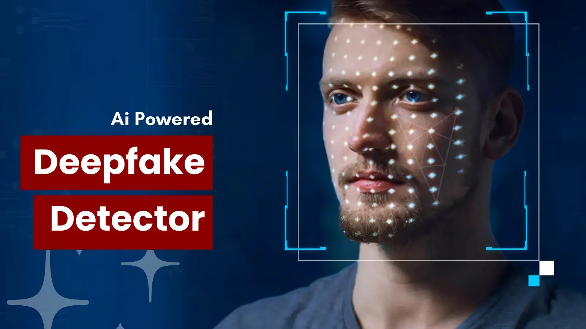

# 🎭 Deepfake Detection System



A Machine Learning–based web application that detects whether an uploaded image is **Real or Deepfake** using a trained deep learning model. This system provides a simple web interface where users can upload images and receive instant predictions.

---

## 🚀 Features

- 🔍 Detects deepfake images using a trained deep learning model  
- 🌐 User-friendly web interface for uploading images  
- ⚡ Fast real-time predictions  
- 🧠 Uses pretrained PyTorch model (`model_epoch_40.pt`)  
- 📂 Image upload and classification support  
- 🔗 Full-stack integration (Frontend + Backend + ML model)

---

## 🛠️ Tech Stack

| Layer              | Technology                  |
|--------------------|-----------------------------|
| Machine Learning   | Python, PyTorch, NumPy, PIL, OpenCV |
| Backend            | Flask                       |
| Frontend           | HTML, CSS, JavaScript      |
| Version Control    | Git, GitHub                |
| CI/CD              | Azure Pipelines            |


---

## 📁 Project Structure
deepfake-detection/
│
├── app.py # Flask backend server
├── model_epoch_40.pt # Trained deep learning model
├── requirements.txt # Dependencies
├── index.html # Homepage UI
├── upload.html # Upload page
├── style.css # Styling
├── script.js # Frontend logic
├── topic.py # ML processing
├── test_app.py # Testing
├── azure-pipelines.yml # CI/CD pipeline
└── README.md # Documentation

---

## ⚙️ Local Setup

Follow these steps to run the project locally:

```bash
# 1. Clone the repository
git clone https://github.com/Kumar070204/deepfake-detection.git

# 2. Navigate into the project folder
cd deepfake-detection

# 3. Create a virtual environment (recommended)
python -m venv venv

# 4. Activate the virtual environment

# Windows
venv\Scripts\activate

# Mac/Linux
source venv/bin/activate

# 5. Install dependencies
pip install -r requirements.txt

# 6. Run the Flask application
python app.py

#Then open your browser and go to:
http://localhost:5000

#Upload an image and view the deepfake detection result


